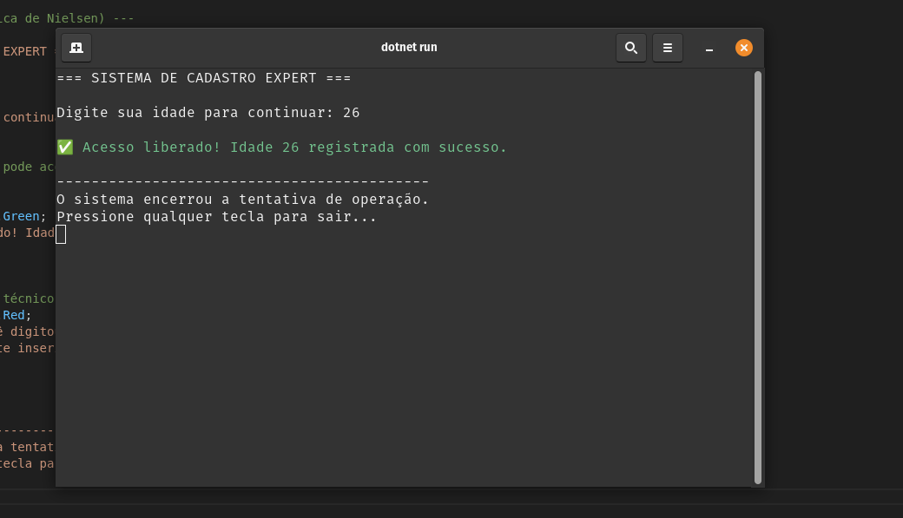
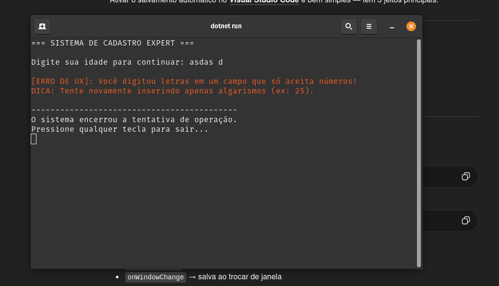

# 🚀 Tratamento de Erros em C# — Prevenção de Erros (IHC)

## 📖 Sobre o Projeto
Este exercício demonstra a utilização de **tratamento de exceções em C#** com foco na melhoria da experiência do usuário, aplicando conceitos da disciplina de **Interação Humano-Computador (IHC)**, especificamente a heurística de **Prevenção de Erros** de Nielsen.

A aplicação simula um sistema simples de cadastro que solicita a idade do usuário e trata entradas inválidas de forma amigável, evitando que o programa seja encerrado abruptamente.

## 🎯 Objetivo
- Demonstrar o uso de `try-catch-finally`
- Evitar falhas no programa causadas por entradas inválidas
- Melhorar a experiência do usuário com mensagens claras
- Aplicar conceitos de usabilidade (IHC) na prática

## ⚙️ Funcionamento do Programa
O sistema solicita ao usuário que digite sua idade:

- Caso o usuário digite um número válido → o sistema confirma o cadastro
- Caso o usuário digite texto ou valor inválido → o erro é tratado e uma mensagem amigável é exibida
- O programa não quebra, mantendo o controle da execução

## 🧠 Conceito de IHC Aplicado
### Prevenção de Erros (Heurística de Nielsen)
O sistema foi projetado para evitar que erros do usuário causem falhas técnicas, fornecendo feedback claro e orientações para correção.

Em vez de exibir mensagens técnicas, o sistema apresenta uma resposta compreensível e útil.

## 💻 Estrutura Utilizada
- `try` → executa o código que pode gerar erro
- `catch` → captura erros de conversão (`FormatException`)
- `finally` → executa sempre, independente de erro ou sucesso
- `int.Parse()` → tentativa de conversão da entrada
- `Console` → entrada e saída de dados

## ▶️ Execução do Programa
Para executar o projeto:

Compilar:
dotnet build

Executar:
dotnet run

## 📸 Evidências de Execução

### ✅ Caminho Feliz (Entrada válida)
Quando o usuário digita um número corretamente:

### ❌ Caminho de Erro (Entrada inválida)
Quando o usuário digita letras ou valores inválidos:

## 💡 Boas Práticas Aplicadas
- tratamento de exceções para evitar falhas
- mensagens de erro amigáveis (UX)
- separação clara de fluxo (sucesso vs erro)
- uso de cores no terminal para melhorar a experiência
- aplicação de conceito de IHC na prática

## 🎓 Conclusão
Este exercício demonstra como o tratamento de erros pode ir além da parte técnica, contribuindo diretamente para a experiência do usuário. A aplicação da heurística de Nielsen evidencia a importância de sistemas que orientam e auxiliam o usuário, evitando frustrações e falhas inesperadas.

## 👨‍💻 Autor
Lucas Cota  
Estudante de Análise e Desenvolvimento de Sistemas  
Foco em Backend e Engenharia de Software
